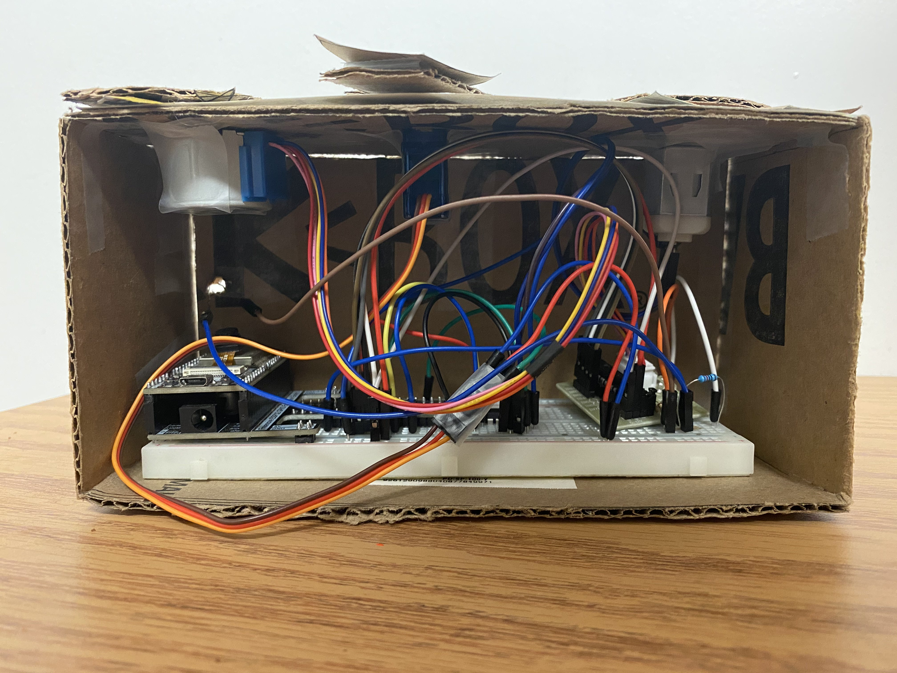
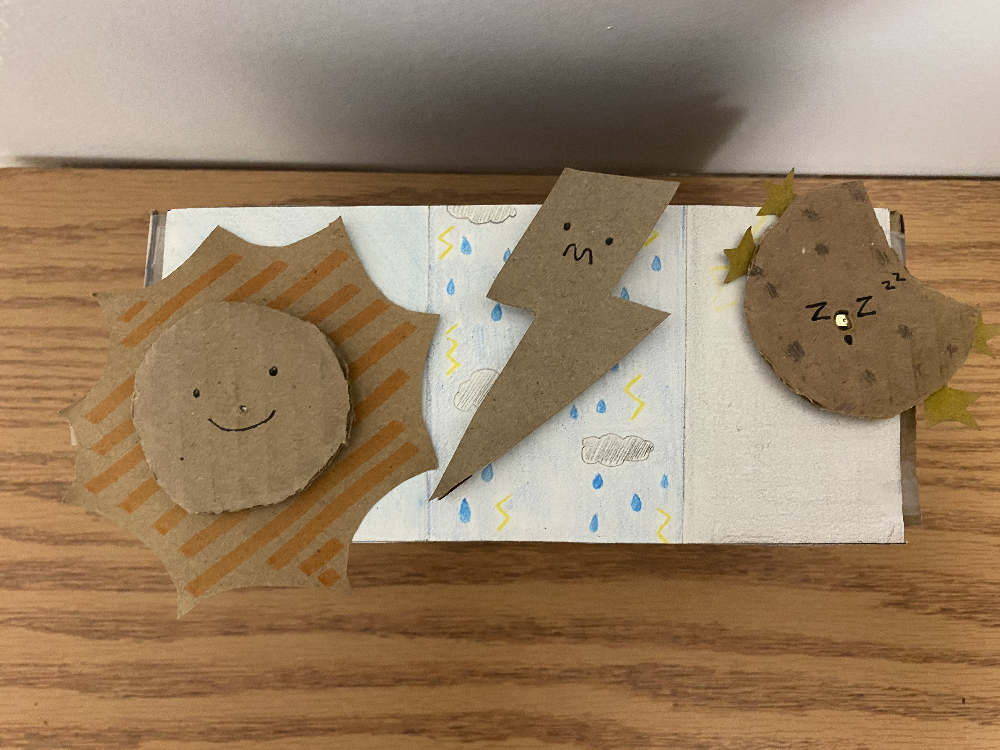
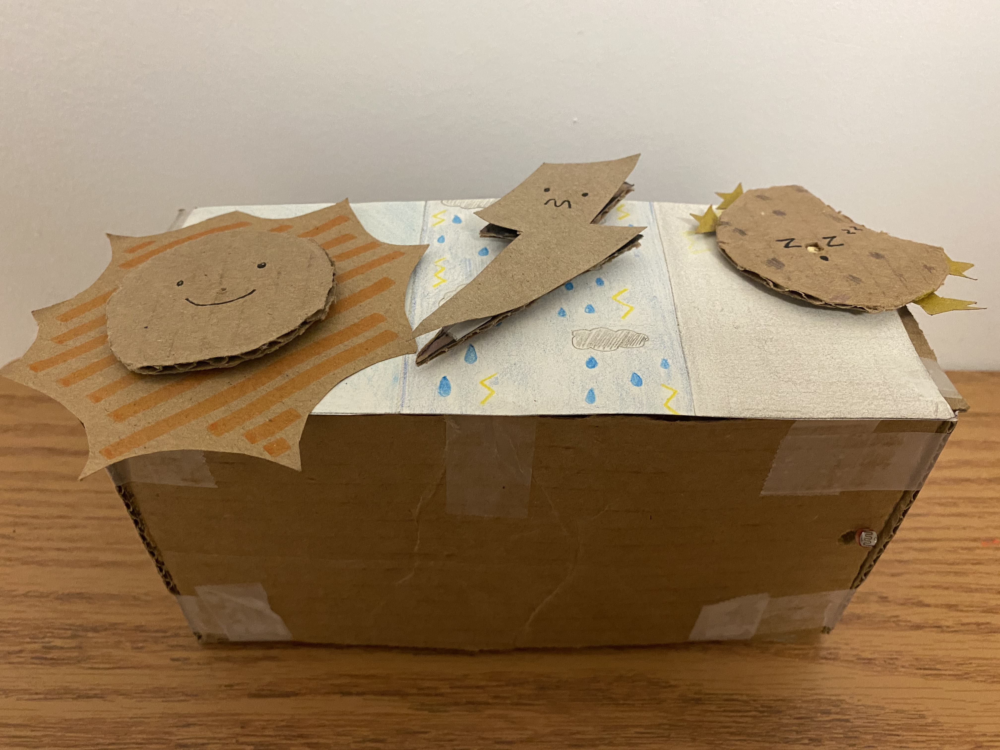

# Interactive Weather Art
COMS BC 3930

Through this module, I have created interactive "weather" (sunny, thunder or moon) art project that reacts to a photoresistor which will provide a value and its generative as it randomizes the direction that the motor is heading towards. None of the objects would move if the light is at the normalized value. If the room is bright the "sun" will start spinning. If the room is dark, it stops any occuring motions and then the "moon" will start to spin. The LEDs (that may be included) shows which state the art is currently on.

## Materials:
- ESP32
- 1 Motor
- 1 L293D
- 1 Stepper Motor
- 1 ULN2003 Stepper Motor Driver
- 1 Photoresistor
- 1 10k Ohm Resistor
- 9V Battery <br />

** Lost count of amt of wires used

## Hardware Configuration
### Stepper Motor Driver
GND - GND <br />
VCC  - 5V <br />
Following are connected to Stepper Motor <br />
A - Blue <br />
B - Pink <br />
C  - Yellow <br />
D  - Orange <br />
PWR  - Red <br />

### L293D
1. Enable 1 - Pin 13 <br />
2. In 1 - Pin 12 <br />
3. Out 1 - Motor Pin <br />
5. 0V - GND <br />
6. Out 2 - Motor Pin <br />
7. In 2 - 14 <br />
8. +VMotor - 9V <br />
16. +V - 3.3V <br />

## Executing Program
1. Go to [Arduino Site](https://www.arduino.cc/en/software)
2. Download appropiate software and install the Arduino IDE
3. Clone interactive-weather-art
```bash
git clone https://github.com/jxm033f/interactive-weather-art.git
```
4. Open Arduino IDE -> File -> Open -> motor-lab.ino <br />
        1. File is located interactive-weather-art/motor-lab
5. Upload Code which will allow it to run through the ESP32
6. In order for the ESP32 to play the interactive art...
        1. Open web browser and go to http://165.227.76.232:3000/jm4607
        2. Press the "Run Sculpture for 30s" button and it will run for 30 seconds

## Images




## Links
[Blog Post](http://edblogs.columbia.edu/comsx3930-001-2021-1/2021/03/26/module-4-interactive-weather-art/) <br />
[Video - Interactive Weather Art](https://youtu.be/jzHyOdg0NOA) <br />
